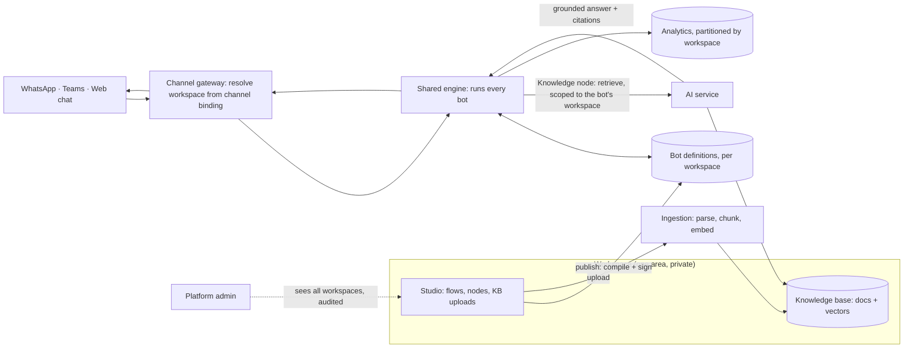

# Bot_Dialog_Generator: product vision

This document records where the platform is going. It is the reference for scoping MVP work and for judging whether a change moves the product toward the target or away from it. The architecture decisions behind it live in [`docs/adr`](adr/).

## Why this exists

Bot_Dialog_Generator is a new project. It is designed around three problems common to first-generation chatbot engines, where each bot's flows are compiled into a single file and deployed on their own:

1. **Every bot becomes a separate project.** Each bot gets its own deployment, and publishing content means a commit, a pipeline run and a restart.
2. **Nothing can be reused.** Bots with the same structure can't share flows, components or improvements, so each one is maintained as its own copy.
3. **There is no AI.** Answers come only from hand-built flows and fuzzy keyword matching, so bots can't draw on what the organization already knows.

## What we are building

**One platform for many areas.** Any area of the company (HR, Credit, IT support, Customer service) gets a private **workspace**. In it, the area builds its own bots with its own flows, its own knowledge base and its own analytics. A shared, dynamic engine runs every bot. Creating a bot never creates a project, a repository or a deployment.

Workspaces are private. Members of an area see only their own area's work. **Only platform administrators can see every bot in the organization.**

Each workspace can attach its own **organizational knowledge**: documents the area uploads, which are indexed as vectors. Bots then answer free-form questions from that knowledge, with citations, inside the flows the area designed.

## Principles

1. **A bot is data, not a deployment.** Creating, publishing or rolling back a bot is a database write and a pointer change.
2. **Private by default, enforced in depth.** Workspace isolation is enforced at every layer: the API, the database (row-level security), object storage, the runtime, the vector index and analytics. Hiding something in the UI is never the only control.
3. **Reuse without copying.** Shared templates and components replace copy-and-paste bots. Forks keep a link to their source so improvements can flow back.
4. **Flows decide, AI assists.** Deterministic flows stay in control of anything regulated or transactional. AI nodes answer from approved knowledge, cite their sources and hand control back to the flow.
5. **Pay for what is used.** Storage and compute are chosen so an idle workspace costs close to nothing, and cost grows with traffic, not with the number of bots.

## Concepts

| Concept | Meaning |
|---|---|
| **Organization** | The company. Today there is one; the model leaves room for more (see open questions). |
| **Workspace** | One area's private space. Owns bots, knowledge bases, channel bindings, members and analytics. |
| **Bot** | A conversational assistant inside a workspace. Has draft and published **versions**. |
| **Flow** | A dialog inside a bot: a graph of **nodes** joined by transitions. |
| **Node** | One step: Trigger, Response, Menu, Service, Jump, plus the new Knowledge and AI Router nodes. |
| **Knowledge base** | A workspace's set of documents, chunked and embedded for retrieval. A bot can use several. |
| **Template** | A reusable bot or flow published to the organization library. Workspaces fork it. |
| **Component** | A shared sub-flow, such as authentication or a satisfaction survey, called by version from any bot. |
| **Channel binding** | A WhatsApp number, Teams app or web widget key attached to one bot in one workspace. |

## Roles

| Capability | Platform admin | Workspace owner | Editor | Analyst | Workspace members of *other* areas |
|---|:-:|:-:|:-:|:-:|:-:|
| See that a workspace's bots exist | ✅ all | ✅ own | ✅ own | ✅ own | ❌ (404, not 403) |
| Create and edit flows | ✅ (audited) | ✅ | ✅ | ❌ | ❌ |
| Publish and roll back | ✅ (audited) | ✅ | ❌ (requests approval) | ❌ | ❌ |
| Manage the knowledge base | ✅ (audited) | ✅ | ✅ | ❌ | ❌ |
| View analytics | ✅ all | ✅ own | ✅ own | ✅ own | ❌ |
| Read conversation transcripts | Break-glass with a reason, audited | ✅ own | ✅ own | ✅ own | ❌ |
| Manage members | ✅ | ✅ own | ❌ | ❌ | ❌ |
| Publish templates and components | ✅ | Proposes; admin approves | ❌ | ❌ | ❌ |
| Bind channels | ✅ | ✅ own | ❌ | ❌ | ❌ |

## How it works

1. **Authoring.** Members build flows in the studio. Every record carries the workspace ID, and the database refuses rows from other workspaces.
2. **Publishing.** The compiler validates the draft and produces a signed definition stored under the workspace's prefix. The active-version pointer moves, and running engines pick it up without restarting.
3. **Runtime.** A channel binding maps an inbound message to exactly one workspace and bot. The engine loads that bot's definition and the user's session, runs one step and returns the replies.
4. **AI.** When a flow reaches a Knowledge node, the engine asks the AI service for an answer. The service searches only that workspace's knowledge base. If nothing relevant is found, the flow takes its "no answer" branch instead of guessing.
5. **Analytics.** Events are partitioned by workspace. Areas see their own dashboards; admins see everything.

## Reuse: templates and components

This is the answer to "three bots with the same structure that cannot be reused":

- **Templates.** A complete bot or flow published to the organization library. A workspace instantiates a template as a fork that records `template_id` and `template_version`. When the template improves, the fork owner sees a diff and chooses what to merge, using a merge and diff tool.
- **Components.** Shared sub-flows owned by the platform workspace, such as authentication, a satisfaction survey or a handoff to a human advisor. Bots call a component by version through a Jump node, so a fix to the component reaches every bot that opts into the new version.
- Templates and components are **read-only** to workspaces. Only platform admins publish them, and workspace owners can propose one for promotion.

## AI knowledge layer

The platform does not train or fine-tune a model per area. Each workspace has a knowledge base of its own documents. At answer time the bot retrieves the most relevant passages and has the model answer only from them, citing its sources. This approach is called retrieval-augmented generation (RAG). It keeps each area's data separate, updates the moment a document changes and costs far less than training. Details are in [ADR 0004](adr/0004-organizational-knowledge-and-ai-nodes.md).

## Data, scaled for cost

Each kind of data goes to the cheapest store that fits how it is read and written:

- **Valkey:** live sessions.
- **Postgres:** authoring data, row-level security and, at first, vectors (pgvector).
- **S3:** documents, definitions and media.
- **S3 Vectors:** vectors, once the corpus grows.
- **DuckDB over Parquet:** analytics.

Development environments scale to zero when idle. Details are in [ADR 0005](adr/0005-low-cost-storage-tiers.md).

## Where the MVP is today

| Capability | Vision | MVP today | Gap |
|---|---|---|---|
| Workspace isolation | Enforced in the API, database, storage, runtime, vectors and analytics | **Done in studio-api (M1):** routes under `/workspaces/{id}`, non-members get 404, roles per workspace, artifacts under `workspaces/{id}/`, CORS allowlist, isolation suite over every route. Database RLS lands with Postgres in M2; runtime and vectors follow their milestones | Partial
| Identity and roles | OIDC login, workspace memberships, roles, admin view, audit log | **Done (M1):** OIDC token verification, dev sign-in, memberships by user and by group, owner/editor/analyst roles, audited admin view. Studio sign-in through the company identity provider (OIDC redirect) is still to do | Partial
| Persistence | Postgres with RLS, S3, Valkey | In-memory store. A SQL migration exists, but no Postgres adapter | Missing |
| Engine | All node types, CEL conditions, version pinning, AI effects | Trigger, Response, Menu, Jump, Service. Menu conditions are string comparisons | Partial |
| AI knowledge | Ingestion, vector search, Knowledge and AI Router nodes, guardrails, evals | None | Missing |
| Templates and components | Organization library, forks with lineage | None | Missing |
| Channels | WhatsApp Cloud, Teams, web chat, all bound to a workspace | Web chat endpoint and widget | Partial |
| Analytics | Per-workspace dashboards, admin roll-up, cost metering | Stub service | Missing |

## Roadmap

The ordered, task-level plan with done-criteria is in [PLAN.md](PLAN.md). The table below is the milestone overview.

Each milestone ends with something an area can use.

| # | Milestone | Done when |
|---|---|---|
| M1 | **Workspaces and identity** — *mostly done* | Done: dev sign-in with signed tokens, OIDC verification, workspace memberships (direct and by group), every route scoped by the authenticated principal, audited admin view, isolation suite. Remaining: studio OIDC redirect sign-in, `workspace_id` in the protobuf contracts and runtime keys, Postgres RLS (moved to M2 with the Postgres adapter) |
| M2 | **Real storage** | Postgres adapter replaces the in-memory store. Signed definitions written to `workspaces/{id}/…` in S3. Sessions in Valkey |
| M3 | **Knowledge base v1** | An area uploads PDFs and DOCX files, which are chunked and embedded into pgvector. A Knowledge node answers with citations. The no-answer branch works. A golden-question eval runs on every knowledge base change |
| M4 | **AI Router and guardrails** | Free text is routed to flow branches with a confidence threshold. PII redaction. Per-workspace token budgets and metering |
| M5 | **Templates and components** | Organization library, fork with lineage, update diff and merge, shared components called by version |
| M6 | **Channels and analytics** | WhatsApp Cloud and Teams bindings per workspace. Per-workspace dashboards. Cost per workspace |
| M7 | **Scale** | Kafka backbone, S3 Vectors adapter, load test against the targets in ADR 0001 |

## Open questions

1. **One company or many?** If the platform will ever serve several companies, the organization layer must be enforced like workspaces are. The contracts already reserve `tenant` for it.
2. **Admin access to conversation content.** Should platform admins see transcripts by default, or only metadata, with transcripts behind break-glass access? The proposal is break-glass with a reason and an audit trail; this needs legal and compliance sign-off.
3. **Model provider and data residency.** The default proposal is Claude on Amazon Bedrock, so prompts and documents stay inside the company's AWS account. This needs the region and data-classification rules for what may be sent to a model.
4. **Knowledge sources.** Uploads only for the MVP, or connectors such as SharePoint and Confluence that keep documents in sync?
5. **Who approves templates?** A platform team, or a rotating design authority drawn from the areas?
